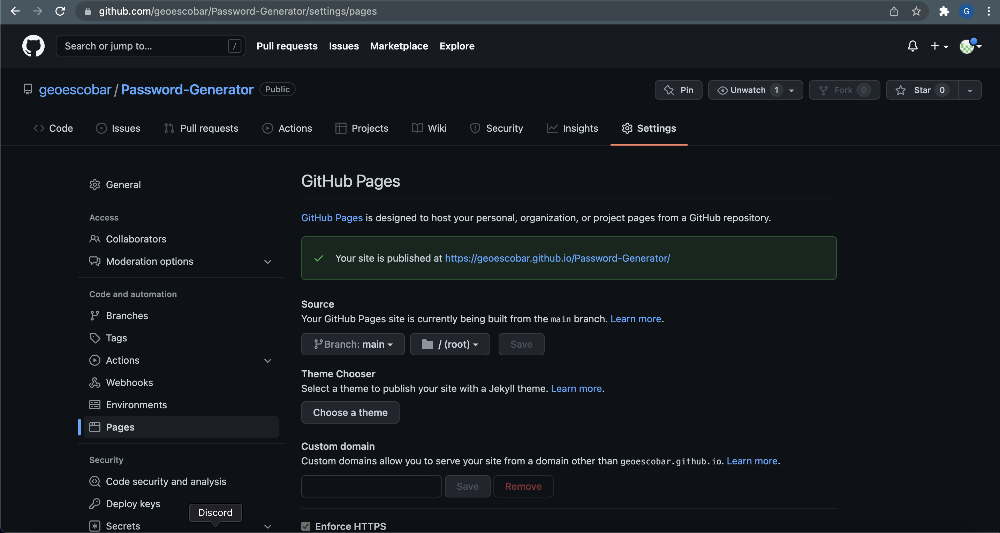

# 03 JavaScript: Password Generator

Welcome to my password generator! 

I began by adding variables with arrays containing the characters that will be apart of the password if selected. 

Next, within the generate password function I included the code for the actual password. I used confirm to decide wether or not to use specific characters. At the end it will populate the password based on the selected characters. For the length of characters was the only time I used prompt.

Once all the actions to decide the length and characters of the password I linked them all into the write password fuction that will display it on the page.

